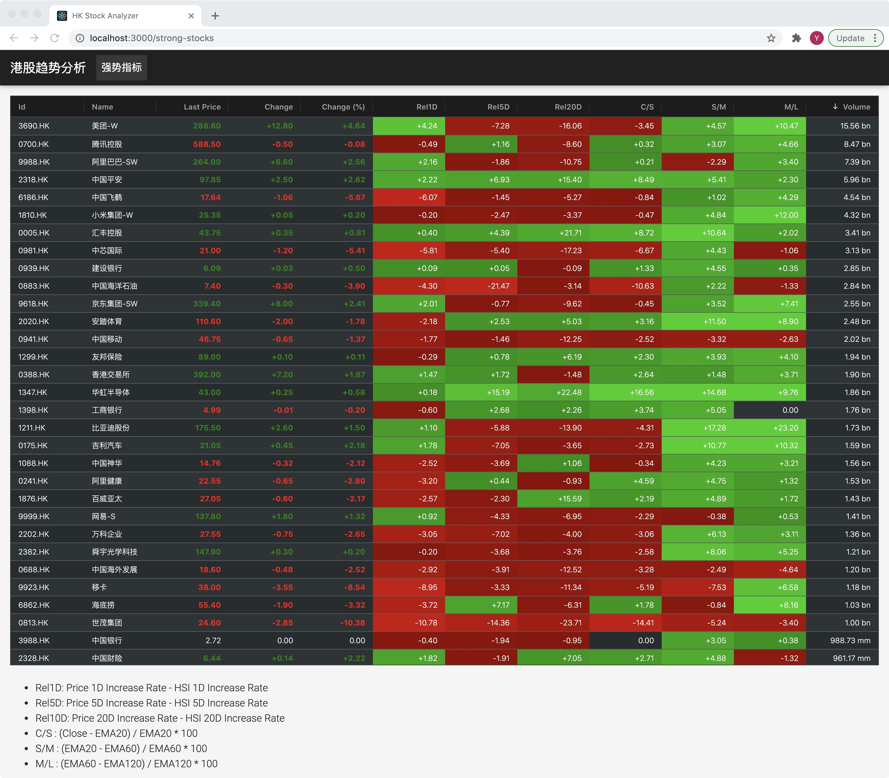

## 港股趋势分析 Web App

### 如何启动程序

【步骤一】：部署好所需的环境，下载并安装
- Python 3+
- NodeJS Latest Version

安装后端依赖
```
cd stock-analyzer-server
pip install requirements.txt
```
安装前端依赖
```
cd ..
cd stock-analyzer-ui
npm install
```

【步骤二】：准备数据
```
cd stock-analyzer-server
python prepare_data.py
```
这个步骤会下载所有的原始数据，并对原始数据进行分析，最终将所有的数据和分析结果存储在 data/store.db 中

【步骤三】：启动后端服务器
```
python main.py
```
启动过后，可以打开浏览器，输入 http://localhost:5000/
如果看到 ‘Server is alive’ 字样，说明后端启动成功

【步骤四】：启动前端服务
```
cd ..
cd stock-analyzer-ui
npm start
```
启动过后，打开浏览器，输入 http://localhost:3000/
即可看到分析结果的网站



### 数据说明
所有的交易数据都不是实时更新的。（实在是找不到实时的港股数据。。。）
数据最多可以做到 T-1 的收盘。
要想获得最新的 T-1 的数据，需要从新跑一遍 
```
python prepare_data.py
```

### 指标说明
- Rel1D: Price 1D Increase Rate - HSI 1D Increase Rate
- Rel5D: Price 5D Increase Rate - HSI 5D Increase Rate
- Rel10D: Price 20D Increase Rate - HSI 20D Increase Rate
- C/S : (Close - EMA20) / EMA20 * 100
- S/M : (EMA20 - EMA60) / EMA60 * 100
- M/L : (EMA60 - EMA120) / EMA120 * 100

对比图中，绿色部分越多，代表当前股票的走势越强，反之则越弱。
股票的持仓组合应该选择保留强势股，剔除弱势股。（一家之言，不构成投资意见）。

### 显示的股票列表
股票列表由两个部分构成
- 一是根据上一个交易日的交易额来选股，交易额超过6千万的股票会放入股票池中
- 二是在 stock-analyzer-server/config.yml 中可以自定义感兴趣的股票，即便在第一个条件被刷下来后，仍然可以它加入股票池

